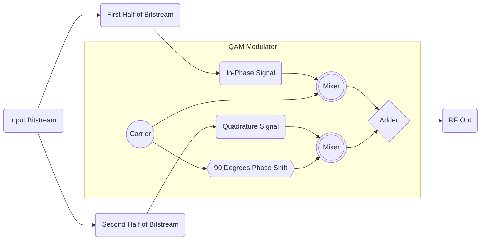

# ***QAM***

## *Implementation of an digital QAM modulation scheme :signal_strength:*

### Scenario
```
1. Starting with mod_order = 4 which corresponds to a 4-QAM implementation, A.K.A QPSK
2. Feed in input data binary stream into QAM block which splits the data into half assigning each half to an In-Phase and a Quadrature signal
3. Add a 90 degree phase shift to the Quadrature signal
4. Mix the amplitudes of the In-Phase and Quadrature signals with the carrier wave
5. Add the resulting complex signals together at the end, this is your resulting QAM modulated signal
```

### Block Diagram


### Build and Run Instructions
```
1. cd ~/git/QAM/scripts
2. ./runQAM.sh
```
